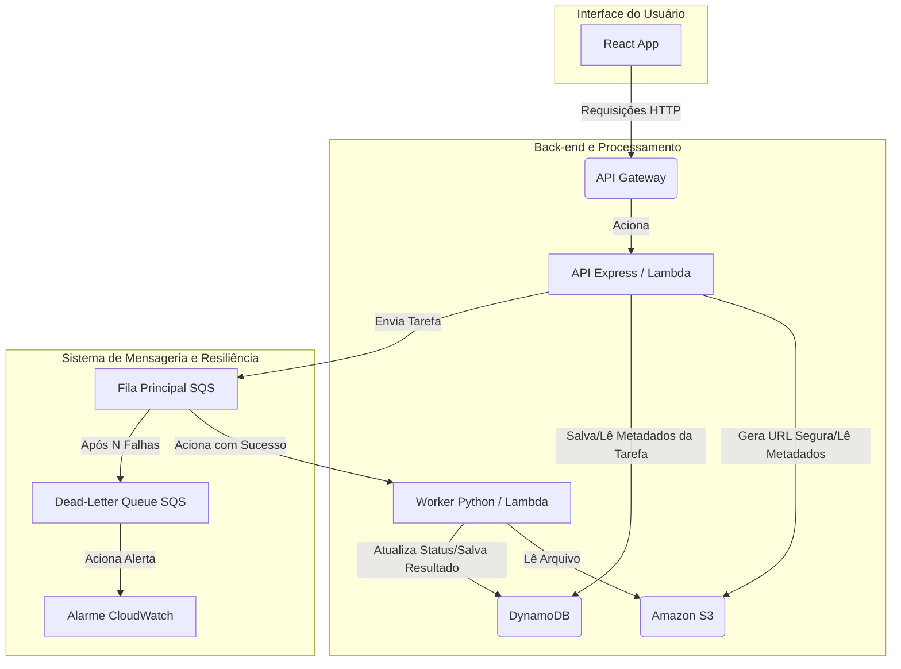

# CodexOCR 📜✍️

*Decifrando cada página, entregando cada palavra.*

[](https://github.com/augolv/codexOCR/actions)
[](https://opensource.org/licenses/MIT)

**CodexOCR** é um projeto full-stack que implementa um processador de PDF assíncrono com OCR (Reconhecimento Óptico de Caracteres), construído sobre uma arquitetura serverless e orientada a eventos na AWS. 

O objetivo principal deste projeto é demonstrar a construção de um sistema de software moderno, resiliente, escalável e bem arquitetado, aplicando as melhores práticas de desenvolvimento, testes automatizados e CI/CD.


---

## 🚀 Funcionalidades Principais

* **Upload de Arquivos:** Interface limpa para fazer upload de arquivos PDF.
* **Processamento Assíncrono:** A API responde instantaneamente e o processamento do OCR acontece em segundo plano, sem travar o usuário.
* **Acompanhamento de Status:** O usuário pode ver o status da tarefa (`Na Fila`, `Processando`, `Concluído`, `Erro`) em tempo real (via polling).
* **Extração de Texto:** Visualização do texto extraído diretamente na interface após a conclusão.
* **Arquitetura Resiliente:** Uso de Dead-Letter Queue (DLQ) para isolar e analisar tarefas que falham, garantindo que o sistema continue operacional.

---

## 🛠️ Stack de Tecnologia

A aplicação é dividida em três componentes principais que se comunicam de forma assíncrona:

* **Front-end:** ⚛️ React (com TypeScript), Vite, e CSS Modules.
* **Back-end (API):** 🔷 Node.js com Express.js e TypeScript.
* **Back-end (Worker):** 🐍 Python 3.11.

A infraestrutura é 100% serverless na **AWS** ☁️, utilizando:

* **API Gateway & AWS Lambda:** Para a execução da API e do Worker.
* **Amazon S3:** Para armazenamento dos arquivos PDF.
* **Amazon SQS:** Para o sistema de filas (Fila Principal e Dead-Letter Queue).
* **Amazon DynamoDB:** Como banco de dados NoSQL para metadados e estado das tarefas.
* **GitHub Actions:** Para o pipeline de CI/CD (testes e deploy automatizados).

---

## 🏗️ Arquitetura do Sistema

O sistema é projetado seguindo os princípios da arquitetura orientada a eventos para garantir desacoplamento e escalabilidade.



---

## ⚙️ Rodando Localmente

Para rodar este projeto no seu ambiente, você precisará ter Node.js, Python, Docker e o AWS CLI configurados.

**1. Clone o repositório:**
```bash
git clone https://github.com/augolv/codexOCR.git
cd codexocr
```

**2. Configure as Variáveis de Ambiente:**
Crie um arquivo `.env` na raiz do projeto, baseado no `.env.example`. Você precisará de credenciais da AWS com as permissões necessárias.

**3. Inicie a Infraestrutura Local:**
Este projeto está configurado para usar o DynamoDB Local via Docker.
```bash
docker-compose up
```

**4. Rode a API Back-end:**
```bash
cd packages/api
npm install
npm run dev
```

**5. Rode o Worker Back-end (em um novo terminal):**
*Recomenda-se o uso de um ambiente virtual (venv).*
```bash
cd packages/worker
python -m venv venv
source venv/bin/activate
pip install -r requirements.txt
# (Instruções para rodar o worker localmente, ex: com um script que simula o SQS)
```

**6. Rode o Front-end (em um novo terminal):**
```bash
cd packages/frontend
npm install
npm run dev
```

---

## 🧪 Testes

A qualidade do código é garantida por uma suíte de testes automatizados.

* **Para rodar os testes da API:**
    ```bash
    cd packages/api
    npm test
    ```
* **Para rodar os testes do Worker:**
    ```bash
    cd packages/worker
    pytest
    ```

---

## 🗺️ Roadmap (Melhorias Futuras)

- [ ] Implementar WebSockets para atualizações de status em tempo real.
- [ ] Suporte para outros formatos de arquivo (JPG, PNG).
- [ ] Contas de usuário para salvar o histórico de arquivos.
- [ ] Opção de download do texto como `.txt` ou PDF pesquisável.

---

Criado com ❤️ por [Augusto Oliveira](https://github.com/augolv)
